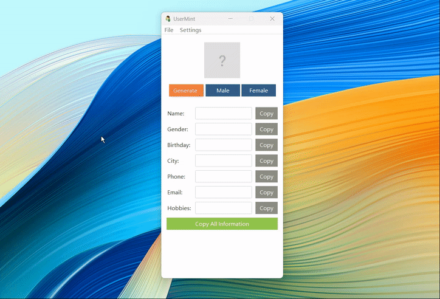
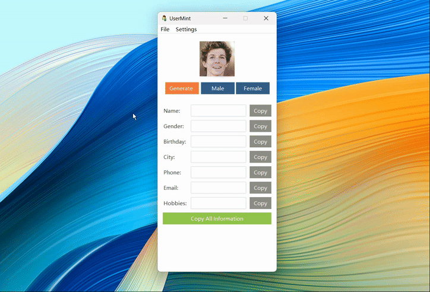

# UserMint:A Tool for One-Click Generation of Realistic User Information and Avatars

**UserMint** is a tool for quickly generating realistic online user information. It supports batch generation of user details such as names, genders, birthdays, cities, emails, and phone numbers, along with random user avatars. Additionally, by integrating the GPT API, it can generate personalized user bios.

## Features
- **One-Click Generation**: Quickly generate complete user information, including names, genders, birthdays, cities, emails, and phone numbers.
- **Realistic Avatars**: Provide randomly generated realistic avatars to enhance the credibility of user information.
- **Personalized Bios**: Generate unique personal bios for each user by integrating the GPT API.
- **User-Friendly GUI**: Simple and intuitive graphical user interface for easy operation.
- **Versatile Applications**: Suitable for creating social media accounts, bulk account creation, and test data generation.

## Use Cases
- **Bulk Social Media Account Creation**: Quickly generate a large number of realistic user profiles for creating social media accounts.
- **Test Data Generation**: Provide simulated user data for development and testing teams.
- **Marketing Campaigns**: Generate user information for market research or marketing activities.

## Getting Started
### System Requirements
- Operating System: Windows
- Python: Version 3.8 or higher (only required if open-sourced)

### Installation
1. Download the latest version of **UserMint**:
   - [Windows Version](https://github.com/emilyCarter000/UserMint/releases/latest)
   - [macOS Version - Not Currently Supported](https://github.com/emilyCarter000/UserMint/releases/latest)
   - [Linux Version - Not Currently Supported](https://github.com/emilyCarter000/UserMint/releases/latest)

2. Extract the downloaded file and run the executable file located in the `dist` folder, such as `UserMint.exe` for Windows.

### Operation Steps
1. Open **UserMint**. In the GUI, click the "Generate Avatar" button to create a random avatar; click the "Male" or "Female" button to get user information of the corresponding gender.
2. Optional: In the "Settings" menu, go to the "GPT Settings" window to enter your GPT API address and key to enable the personal bio generation feature.
3. The generated user information will be displayed on the interface. Click the "Copy All Information" button to copy all user information in Excel format for quick pasting.

## Important Notes
- Ensure that **UserMint** is used within legal and compliant boundaries, avoiding any use that violates privacy or legal regulations.
- If you need to use the GPT API to generate personal bios, make sure you have a valid API key and comply with the relevant terms of use.

## Open Source Plan
The code for **UserMint** is not currently open-source, but it is planned to be open-sourced in the future and will remain free. After open-sourcing, it will follow the [MIT License](https://opensource.org/licenses/MIT).

## Contact Information
- If you have any questions or suggestions, please submit feedback through [Issues](https://github.com/emilyCarter000/UserMint/issues).
- You can also contact me via email: [hartpatti865@gmail.com](mailto:hartpatti865@gmail.com)

## Special Thanks
Thank you to all the users who support and use **UserMint**! Your feedback is very important to us.

---

*UserMint* is a constantly updating and improving tool. Follow our [Releases page](https://github.com/emilyCarter000/UserMint/releases) to get the latest version.
